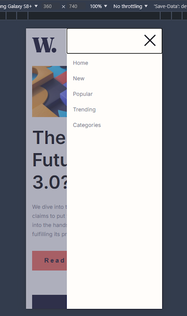
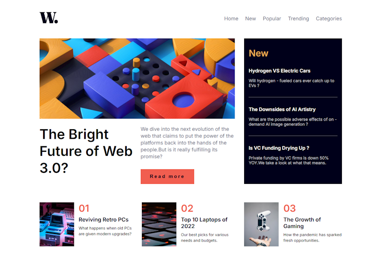

# News homepage project

This is my solution to
the [News homepage challenge on Frontend Mentor](https://www.frontendmentor.io/challenges/news-homepage-H6SWTa1MFl).
Frontend Mentor challenges help you improve your coding skills by building realistic projects.

## Table of contents

- [Overview](#overview)
   - [The challenge](#the-challenge)
   - [Screenshot](#screenshot)
   - [Links](#links)
- [My process](#my-process)
   - [Built with](#built-with)
   - [What I learned](#what-i-learned)
   - [Continued development](#continued-development)
- [Author](#author)

## Overview

### The challenge

### Screenshot

#### Mobile view



#### Desktop view



### Links

- Solution URL: https://github.com/FJSolutions/fm-news-homepage/
- Live Site URL: https://fbj-fm-news-homepage.netlify.app/

## My process

### Built with

- Semantic HTML5 markup
- CSS custom properties
- Flexbox
- CSS Grid
- Mobile-first workflow
- [Astro.js](https://astro.build/) - Web framework
- [Preact](https://preactjs.com/) - JS library
- [LightningCSS](https://lightningcss.dev/) - For styles
- [Vitest](https://vitest.dev/)

### What I learned

Writing the mobile Nav component from scratch was a treat - first time I have done it completely from scratch and while
it can be improved with some animations, it is functionally adequate for the project. It is also fully accessible.

```html

<nav>
   
   <div id="mobile-menu" aria-label="open">
      <div id="mobile-menu-backdrop"></div>
      <div id="mobile-menu-nav">
         <label for="mobile-menu-button" tabindex="0" id="mobile-menu-trigger" aria-label="open" role="button"
                aria-expanded="false"
                aria-haspopup="true" aria-controls="mobile-menu-nav">
            <input type="checkbox" id="mobile-menu-button">
            
         </label>
         <ul id="mobile-menu-links" aria-hidden="true">
            <li><a href="#" class="menu-anchor" aria-current="page">Home</a></li>
            <li><a href="#" class="menu-anchor">New</a></li>
            <li><a href="#" class="menu-anchor">Popular</a></li>
            <li><a href="#" class="menu-anchor">Trending</a></li>
            <li><a href="#" class="menu-anchor">Categories</a></li>
         </ul>
      </div>
   </div>
</nav>
```

I have been using `lightningcss` simply for its speed and minification, but had wanted to experiment with some of its
additional feature. This was the first opportunity I've had. I used the literal imports feature to declare my custom
media queries in a separate them into the main CSS file and each component that used a media query, as below:

```css
@import "../styles/media.css";

@media screen and (--mobile) {
   nav {
      margin-block-end: 2rem;
   }

   ...
}
```

### Continued development

This page (and the site that springs from it) needs database backend and a server to serve dynamic content.

Alternatively, I may revisit the project and retrofit it with Astro content collections.

## Author

- Frontend Mentor - [Francis Judge](https://www.frontendmentor.io/profile/FJSolutions)
